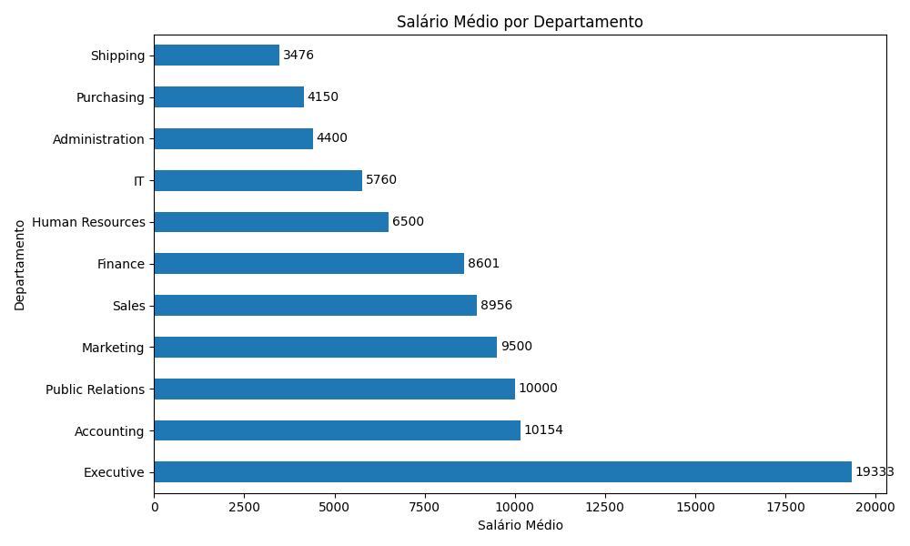
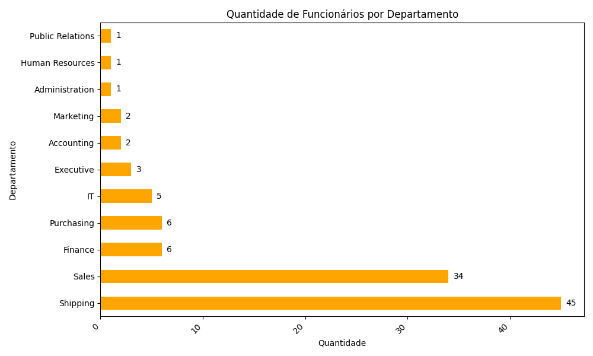
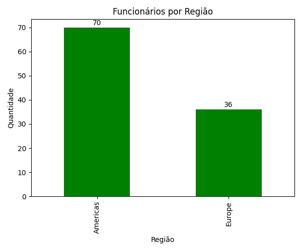
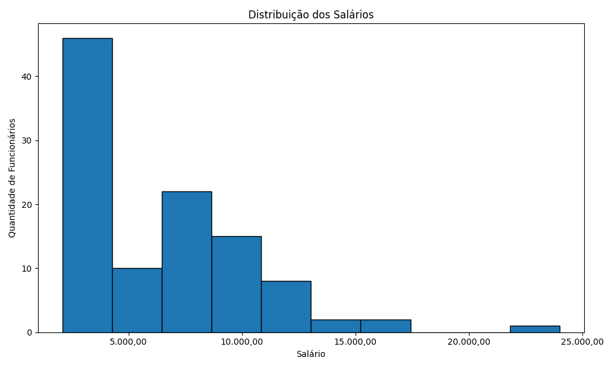
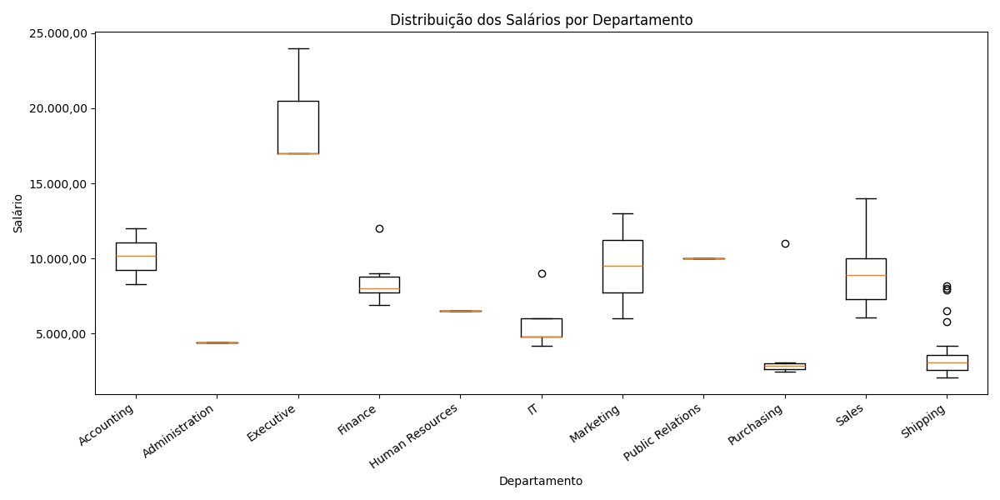

# Projeto Final - Semestre 1
Situação de Aprendizagem (Projeto Avaliativo) - Módulo1 - Semana 13

Turma: Visualização de Dados e Business Intelligence [T2]
Aluno: Stefano Laurito

# Objetivo

Desenvolver um projeto de Análise Exploratória de Dados (EDA) utilizando a base Human Resources (HR) do FreeSQL.

O projeto contempla consultas SQL com múltiplos LEFT JOIN, exportação dos dados para CSV, análise utilizando Python/Pandas e geração de gráficos estatísticos para apoiar a interpretação dos dados.

# Tecnologias Utilizadas

- SQL
- FreeSQL
- Python 3
- Pandas
- Matplotlib
- Git
- GitHub
- Visual Studio Code

---

# Estrutura do Projeto

```
projeto_final_s1/
│
├── consultas/
│   ├── query1.sql
│   ├── query2.sql
│   ├── query1.csv
│   └── query2.csv
│
├── graficos/
│   ├── salario_medio_departamento.png
│   ├── funcionarios_departamento.png
│   ├── funcionarios_regiao.png
│   ├── histograma_salarios.png
│   └── boxplot_departamentos.png
│
├── projeto_final_s1.py
│
└── README.md
```

# Consultas SQL

-- Query 1

Relaciona as tabelas:

- EMPLOYEES
- DEPARTMENTS
- JOBS

Objetivo:

Analisar os salários dos funcionários de acordo com seus departamentos e cargos.

Foi utilizado:

- LEFT JOIN
- WHERE

-- Query 2

Relaciona as tabelas:

- EMPLOYEES
- DEPARTMENTS
- LOCATIONS
- COUNTRIES
- REGIONS

Objetivo:

Analisar a distribuição geográfica dos funcionários juntamente com suas informações salariais.

Foi utilizado:

- LEFT JOIN
- WHERE

# Etapas da Análise em Python

Durante a análise exploratória foram realizadas as seguintes etapas:

- Importação dos arquivos CSV;
- Visualização inicial dos dados;
- Verificação da estrutura dos DataFrames;
- Identificação de valores nulos;
- Verificação de registros duplicados;
- Estatísticas descritivas dos salários;
- Agrupamentos por departamento, cargo, país e região;
- Geração de gráficos para análise visual;
- Conclusões finais.

---

# Principais Resultados

- Total de funcionários analisados: **106**
- Salário médio: **R$ 6.456,75**
- Mediana salarial: **R$ 6.150,00**
- Maior salário: **R$ 24.000,00**
- Menor salário: **R$ 2.100,00**
- Executive apresentou a maior média salarial.
- Shipping possui o maior número de funcionários.
- A região Americas concentra a maior parte dos colaboradores.
- Apenas um registro apresentou valor nulo na coluna **STATE_PROVINCE**.
- Não foram encontrados registros duplicados.

# Visualizações Geradas

## 1. Salário Médio por Departamento

Este gráfico apresenta a média salarial de cada departamento.



---

## 2. Quantidade de Funcionários por Departamento

Exibe a quantidade de funcionários em cada departamento.



---

## 3. Funcionários por Região

Mostra a distribuição dos funcionários entre as regiões.



---

## 4. Histograma da Distribuição dos Salários

Representa a frequência dos salários em diferentes faixas salariais.



---

## 5. Boxplot da Distribuição dos Salários por Departamento

Permite comparar a mediana, a dispersão e possíveis outliers dos salários entre os departamentos.



---

# Como Executar

1. Clonar o repositório.
2. Instalar as bibliotecas necessárias:

```bash
pip install pandas matplotlib
```

3. Executar:

```bash
python projeto_final_s1.py
```

---

# Melhorias Futuras

Como evolução do projeto, podem ser implementadas:

- Dashboards interativos com Power BI ou Plotly;
- Novas métricas estatísticas;
- Filtros dinâmicos;
- Integração direta com banco de dados, eliminando a necessidade de exportação manual dos arquivos CSV.